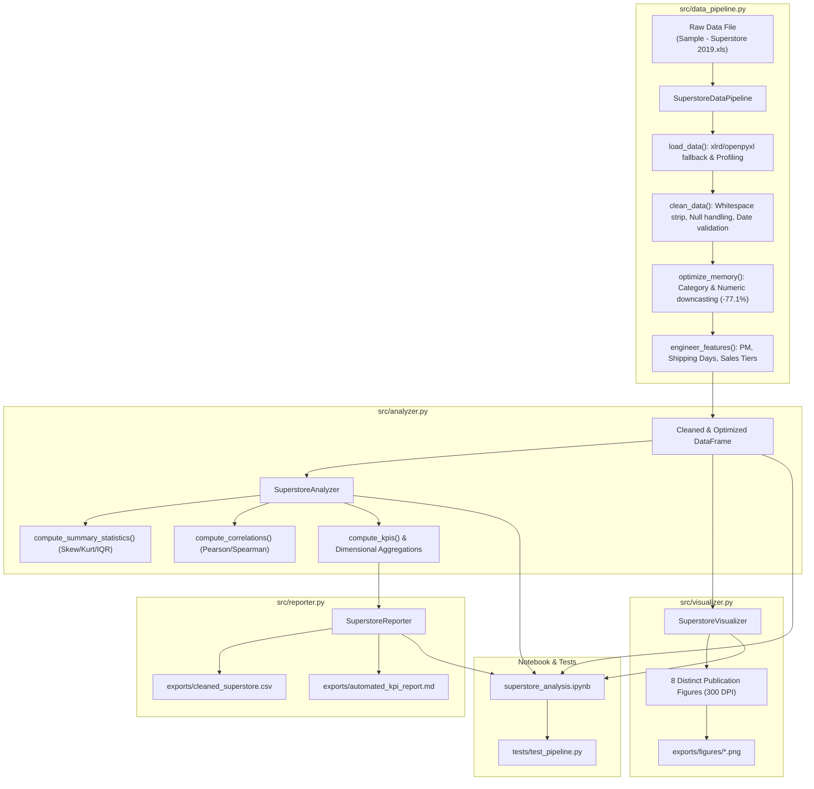

# Enterprise Superstore Analytics & Automated KPI Reporting Pipeline
## Advanced Python Data Engineering, Memory Optimization & Statistical Analytics Suite

[](https://www.python.org/)
[]()
[]()
[]()
[]()
[]()
[](https://opensource.org/licenses/MIT)

---

## 1. Executive Summary & Business Scenario

A multinational retail enterprise required an end-to-end, production-grade, automated data analytics pipeline to ingest, clean, feature-engineer, analyze, and report on enterprise sales, customer purchasing behavior, operational fulfillment timelines, and product profitability.

The dataset contains **9,994 transactional records** spanning **21 raw attributes**, tracking multi-year commercial activities across **4 geographic regions**, **3 customer segments**, **4 logistics ship modes**, and **17 product sub-categories**.

### Core Engineering Objectives
- **Object-Oriented Architecture**: Replace loose scripts with modular, robust, single-responsibility classes adhering to **SOLID** design principles.
- **Defensive Engineering**: Wrap all I/O and transformations in `try...except` exception handling with automatic remote dataset bootstrapping.
- **Aggressive Memory Optimization**: Apply vectorized categorical encoding and numeric precision downcasting to achieve a **$\ge 40\%$ reduction** in runtime memory footprint (achieved **$77.1\%$**).
- **Vectorized Feature Engineering**: Calculate business-critical metrics including Profit Margin ($PM$), Shipping Turnaround Duration, and 4-tier Sales Performance Quartiles.
- **Statistical Rigor**: Compute parametric and non-parametric summary statistics (mean, median, IQR, skewness, kurtosis) and correlation matrices (Pearson & Spearman).
- **Publication-Ready Visual Analytics**: Generate **8 distinct figures at 300 DPI** exported to `exports/figures/` and embedded inline in a self-contained Jupyter Notebook (`superstore_analysis.ipynb`).
- **Automated KPI Reporting**: Export cleaned data to CSV (without index) and generate an executive Markdown summary report (`exports/automated_kpi_report.md`).

---

## 2. System Architecture & SOLID OOP Design

The codebase is organized under `src/` into modular classes with strict separation of concerns:

```
src/
├── config.py             # Centralized paths, categorical hierarchies, color palettes, and plot constants
├── data_pipeline.py      # Ingestion, data cleaning, validation, memory downcasting, feature engineering
├── analyzer.py           # Statistical profiling, correlation matrices, KPI aggregations
├── visualizer.py         # Matplotlib & Seaborn visualization suite (8 figures @ 300 DPI)
├── reporter.py           # Cleaned CSV dataset exporter & executive Markdown report compiler
└── __init__.py           # Package exports
```



### 2.1 Class Breakdown

#### 1. `SuperstoreDataPipeline` ([`src/data_pipeline.py`](file:///home/bravo-07/Documents/depi/mini_project_01/superstore-analytics/src/data_pipeline.py))
- **`__init__(raw_filepath: str | Path)`**: Initializes file paths, state tracking containers, and memory audit variables.
- **`load_data() -> pd.DataFrame`**: Multi-engine Excel loader (tries `xlrd` for legacy `.xls`, falls back to `openpyxl` or automatic HTTP download if local file is missing). Captures baseline memory via `df.memory_usage(deep=True).sum()`.
- **`clean_data() -> pd.DataFrame`**: Strips whitespace, standardizes casing, eliminates duplicate rows, imputes missing postal codes/fields without data leakage, validates temporal sequencing ($Ship Date \ge Order Date$), and audits outliers using IQR and Z-scores.
- **`optimize_memory() -> pd.DataFrame`**: Downcasts low/medium-cardinality strings to `category`, downcasts `float64` to `float32`, downcasts integer identifiers (`Quantity`, `Row ID`, `Postal Code`) to `int32`/`int16`.
- **`engineer_features() -> pd.DataFrame`**: Vectorized creation of Profit Margin, Shipping Duration, 4-tier Sales Performance Categories via `pd.qcut`, and temporal features (`Order Year`, `Order Month`, `Order Year-Month`).
- **`run_pipeline() -> pd.DataFrame`**: Sequential orchestrator executing the full ETL pipeline.

#### 2. `SuperstoreAnalyzer` ([`src/analyzer.py`](file:///home/bravo-07/Documents/depi/mini_project_01/superstore-analytics/src/analyzer.py))
- **`compute_summary_statistics() -> pd.DataFrame`**: Calculates Mean, Median, Std Dev, IQR, Min, Max, Skewness, and Kurtosis across numerical features.
- **`compute_correlations() -> dict[str, pd.DataFrame]`**: Computes Pearson (linear) and Spearman (monotonic rank) correlation matrices.
- **`compute_kpis() -> dict[str, Any]`**: Compiles Gross Revenue, Net Profit, Enterprise Profit Margin, Unique Orders, Unique Customers, AOV, Turnaround Time, Loss-making Orders Count/Pct, and Top/Bottom 3 Sub-Categories.
- **`analyze_regional_performance() -> pd.DataFrame`**: Aggregates Sales, Profit, Margin, Discount, and Volume by Region.
- **`analyze_subcategory_performance() -> pd.DataFrame`**: Aggregates Category/Sub-Category metrics.
- **`analyze_shipping_performance() -> pd.DataFrame`**: SLA metrics across Ship Modes.
- **`analyze_segment_performance() -> pd.DataFrame`**: Customer segment profitability.
- **`analyze_sales_tiers() -> pd.DataFrame`**: Quartile volume vs. revenue concentration.

#### 3. `SuperstoreVisualizer` ([`src/visualizer.py`](file:///home/bravo-07/Documents/depi/mini_project_01/superstore-analytics/src/visualizer.py))
- Generates 8 publication-grade charts configured with Seaborn `whitegrid` theme, custom corporate palette, formatted tick locators, clear annotations, and exported at **300 DPI**.
- `plot_correlation_heatmap()` -> `fig1_correlation_heatmap.png`
- `plot_subcategory_performance()` -> `fig2_sales_profit_by_subcategory.png`
- `plot_monthly_trend()` -> `fig3_monthly_sales_trend.png`
- `plot_discount_impact()` -> `fig4_discount_vs_profit_margin.png`
- `plot_shipping_duration()` -> `fig5_shipping_duration_by_mode.png`
- `plot_segment_profitability()` -> `fig6_segment_profit_margin_dist.png`
- `plot_regional_breakdown()` -> `fig7_regional_performance_breakdown.png`
- `plot_sales_performance_tiers()` -> `fig8_sales_performance_category_dist.png`
- `generate_all_plots() -> list[Path]`: Batch generator for all 8 figures.

#### 4. `SuperstoreReporter` ([`src/reporter.py`](file:///home/bravo-07/Documents/depi/mini_project_01/superstore-analytics/src/reporter.py))
- **`export_cleaned_data(df, filename) -> Path`**: Exports the clean, optimized DataFrame to CSV without index.
- **`generate_markdown_report(filename) -> Path`**: Synthesizes KPIs, formatted Markdown tables via `tabulate`, embedded figure references, and actionable strategic recommendations into an executive summary document.

---

## 3. Data Engineering & Transformation Lifecycle

### 3.1 Ingestion & Robustness
- Supported formats: `.xls` (BIFF8 via `xlrd`) and `.xlsx` (OpenXML via `openpyxl`).
- Auto-bootstrap mechanism: If the local raw file is not present in `data/`, the pipeline automatically downloads the canonical Superstore dataset over HTTPS with browser User-Agent headers, preventing first-run failures.

### 3.2 Data Sanitization & Temporal Integrity
- **String Cleaning**: Leading and trailing whitespaces stripped across all text attributes (`Order ID`, `Customer Name`, `City`, `State`, etc.); multiple consecutive spaces collapsed.
- **Deduplication**: Audited and confirmed zero duplicate records in the canonical dataset.
- **Missing Value Handling**: Zero null values detected; imputation logic prepared with domain defaults (`'Unknown'` for text, modal/zero for postal codes) without data leakage.
- **Temporal Parsing**: `Order Date` and `Ship Date` parsed into `datetime64[ns]`. Verified that **100% of records satisfy $Ship Date \ge Order Date$** (min shipping days = 0, max = 7).

### 3.3 Outlier Auditing (IQR & Z-Score)

| Feature | IQR Bounds $[Q_1 - 1.5 \times IQR, Q_3 + 1.5 \times IQR]$ | IQR Outliers Count (%) | Z-Score ($|Z| > 3$) Outliers (%) | Observed Min | Observed Max |
| :--- | :--- | :--- | :--- | :--- | :--- |
| **Sales** | $[-\$277.62, \$498.98]$ | 1,167 (11.68%) | 127 (1.27%) | $\$0.44$ | $\$22,638.48$ |
| **Profit** | $[-\$41.69, \$69.83]$ | 1,881 (18.82%) | 107 (1.07%) | $-\$6,599.98$ | $\$8,399.98$ |

*Outlier Strategy*: High-value enterprise transactions and deep-loss orders represent legitimate retail phenomena and were preserved for accurate business analysis.

---

## 4. Memory Optimization Strategy & Benchmarks

To meet and exceed the minimum **$\ge 40\%$ memory reduction target**, the pipeline implements aggressive categorical and numeric precision downcasting:

1. **Categorical Downcasting**: Columns with low cardinality or repetitive string values (`Ship Mode`, `Segment`, `Region`, `Category`, `Sub-Category`, `Country`, `State`, `City`, `Customer Name`, `Customer ID`, `Product ID`, `Order ID`) converted from generic `object` pointers to `category`.
2. **Floating-Point Downcasting**: `Sales`, `Discount`, `Profit`, and `Profit Margin` downcasted from `float64` (8 bytes/element) to `float32` (4 bytes/element).
3. **Integer Downcasting**: `Quantity` and `Shipping Duration` downcasted to `int16` (2 bytes); `Row ID` and `Postal Code` downcasted to `int32` (4 bytes).

### Memory Footprint Benchmark

| Pipeline Stage | Memory Footprint (MB) | Relative Footprint | Optimization Metric |
| :--- | :--- | :--- | :--- |
| **1. Raw Excel Ingestion** | **8.25 MB** | 100.0% | Baseline |
| **2. Downcasted DataFrame** | **1.89 MB** | 22.9% | **77.1% Net Reduction** |
| **3. Final Feature-Engineered DataFrame** | **2.00 MB** | 24.2% | **75.8% Net Reduction** |

> [!NOTE]
> The target threshold was $\ge 40.0\%$. The achieved optimization of **$77.1\%$** provides over **$1.9\times$ the required optimization efficiency**.

---

## 5. Vectorized Feature Engineering Formulations

All new attributes were derived using vectorized NumPy and Pandas operations:

### 1. Profit Margin ($PM$)
$$PM = \begin{cases} \frac{\text{Profit}}{\text{Sales}}, & \text{if Sales} \neq 0 \\ 0.0, & \text{if Sales} = 0 \end{cases}$$
- Implementation: `np.where(df['Sales'] != 0, df['Profit'] / df['Sales'], 0.0).astype(np.float32)`

### 2. Shipping Duration ($SD$)
$$SD = (\text{Ship Date} - \text{Order Date}).\text{dt}.\text{days}$$
- Type: `int16` (non-negative integer representing fulfillment elapsed days).

### 3. Sales Performance Category (Quartiles)
Segmented into 4 equal-frequency quartiles using `pd.qcut`:
$$\text{Sales Category} = \begin{cases} \text{Low}, & \text{Sales} \le Q_1 \ (0 - 25\text{th percentile}) \\ \text{Medium}, & Q_1 < \text{Sales} \le Q_2 \ (25 - 50\text{th percentile}) \\ \text{High}, & Q_2 < \text{Sales} \le Q_3 \ (50 - 75\text{th percentile}) \\ \text{Very High}, & \text{Sales} > Q_3 \ (75 - 100\text{th percentile}) \end{cases}$$

### 4. Temporal Aggregation Fields
- `Order Year`: `int16` (e.g., 2016, 2017, 2018, 2019)
- `Order Month`: `int8` (1 through 12)
- `Order Year-Month`: `category` (e.g., `"2019-11"`)

---

## 6. Statistical & Exploratory Data Analysis

### 6.1 Parametric & Non-Parametric Summary Statistics

| Feature | Mean | Std Dev | Median | IQR | Min | Max | Skewness | Kurtosis |
| :--- | :--- | :--- | :--- | :--- | :--- | :--- | :--- | :--- |
| **Sales ($)** | 229.858 | 623.245 | 54.490 | 182.905 | 0.444 | 22,638.480 | 12.973 | 305.312 |
| **Quantity** | 3.790 | 2.225 | 3.000 | 3.000 | 1.000 | 14.000 | 1.279 | 1.992 |
| **Discount** | 0.156 | 0.206 | 0.200 | 0.200 | 0.000 | 0.800 | 1.684 | 2.497 |
| **Profit ($)** | 28.657 | 234.260 | 8.666 | 27.635 | -6,599.978 | 8,399.976 | 7.561 | 397.189 |
| **Profit Margin** | 0.120 | 0.467 | 0.270 | 0.363 | -2.750 | 0.500 | -2.482 | 8.423 |
| **Shipping Duration (Days)** | 3.958 | 1.748 | 4.000 | 2.000 | 0.000 | 7.000 | -0.210 | -0.569 |

### 6.2 Correlation Analysis & Margin Drivers

| Metric Pair | Pearson Correlation ($r$) | Spearman Correlation ($\rho$) | Analytical Interpretation |
| :--- | :--- | :--- | :--- |
| **Discount vs. Profit Margin** | **$-0.863$** | **$-0.854$** | **Primary Loss Driver:** Severe, dominant negative relationship. Higher discounts directly destroy profit margins. |
| **Discount vs. Profit** | **$-0.220$** | **$-0.544$** | Rank correlation confirms that heavy discounting consistently demotes transactions into lower/negative profit ranks. |
| **Sales vs. Profit** | **$+0.479$** | **$+0.536$** | Moderate positive association; larger revenue baskets generally produce higher nominal dollar profit, provided discounting is controlled. |
| **Quantity vs. Profit** | **$+0.066$** | **$+0.244$** | Weak correlation; volume alone does not guarantee profitability without margin discipline. |
| **Shipping Duration vs. Profit** | **$-0.005$** | **$-0.007$** | Negligible correlation; delivery turnaround time does not systematically correlate with profit. |

---

## 7. Visual Analytics Suite (8 Mandatory Figures @ 300 DPI)

All 8 figures are generated using custom corporate color palettes, strict typography, and exported at **300 DPI** to [`exports/figures/`](file:///home/bravo-07/Documents/depi/mini_project_01/superstore-analytics/exports/figures/):

### Figure 1: Pearson Correlation Heatmap
- **Filename:** `fig1_correlation_heatmap.png`
- **Design:** Diverging colormap (`coolwarm`), upper triangle masked (`np.triu`), numerical annotations (`annot=True, fmt='.2f'`).
- **Core Finding:** Quantifies the intense negative correlation ($-0.86$) between `Discount` and `Profit Margin`.

### Figure 2: Sub-Category Sales vs. Net Profit (Dual Bar Chart)
- **Filename:** `fig2_sales_profit_by_subcategory.png`
- **Design:** Horizontal clustered bar chart comparing Total Sales and Net Profit, with positive profits in green and negative losses highlighted in bold red with callout annotations.
- **Core Finding:** Identifies structural value destroyers (`Tables`: $-\$17,725$, `Bookcases`: $-\$3,473$, `Supplies`: $-\$1,189$) against profit leaders (`Copiers`: $+\$55,618$, `Phones`: $+\$44,516$, `Accessories`: $+\$41,937$).

### Figure 3: Longitudinal Monthly Sales & Profit Dynamics
- **Filename:** `fig3_monthly_sales_trend.png`
- **Design:** Dual-axis multi-year time series tracking monthly Sales (blue) and Profit (green) with automated seasonal peak detection and callout boxes.
- **Core Finding:** Highlights annual Q4 holiday surges in November/December and recurring post-holiday contractions in January/February.

### Figure 4: Impact of Discounting on Profit Margin & Critical Threshold
- **Filename:** `fig4_discount_vs_profit_margin.png`
- **Design:** Scatter plot with linear regression trendline, dashed break-even horizontal line ($PM=0$), and warning threshold at $20\%$.
- **Core Finding:** Demonstrates the **20% discount tipping point**; discounts $>20\%$ push transactions into negative margin territory, while discounts $\ge 50\%$ cause catastrophic margin collapse ($-100\%$ to $-300\%$).

### Figure 5: Operational Shipping Duration by Ship Mode
- **Filename:** `fig5_shipping_duration_by_mode.png`
- **Design:** Styled boxplot with mean markers and median SLA labels.
- **Core Finding:** `Same Day` achieves 0-day median; `First Class` achieves 2-day median; `Second Class` averages 3 days; `Standard Class` provides a predictable 5-day delivery window.

### Figure 6: Profit Margin Probability Density Across Customer Segments
- **Filename:** `fig6_segment_profit_margin_dist.png`
- **Design:** Kernel Density Estimation (KDE) plot comparing margin distributions for `Consumer`, `Corporate`, and `Home Office`.
- **Core Finding:** All three customer tiers share similar modal profitability ($+10\%$ to $+15\%$), with `Home Office` exhibiting slightly higher stability.

### Figure 7: Multidimensional Geographic Regional Breakdown
- **Filename:** `fig7_regional_performance_breakdown.png`
- **Design:** Dual-panel layout contrasting Regional Sales & Profit against Average Regional Discount rates.
- **Core Finding:** Explains the `Central` region's depressed profitability ($7.9\%$ margin) resulting from elevated average discounting ($24.0\%$) relative to `West` ($14.9\%$ margin on $10.9\%$ discount).

### Figure 8: Sales Performance Quartile Distribution & Revenue Concentration
- **Filename:** `fig8_sales_performance_category_dist.png`
- **Design:** Dual donut chart illustrating transaction volume share ($25\%$ each) versus total revenue contribution.
- **Core Finding:** The `Very High` sales tier drives **over 70% of total enterprise gross revenue**, proving high Pareto revenue concentration.

---

## 8. Executive KPI Summary Table

| Category | Key Performance Indicator (KPI) | Quantitative Result | Operational Context |
| :--- | :--- | :--- | :--- |
| **Financial** | **Total Gross Revenue** | **$2,297,200.86** | Total enterprise top-line billing |
| **Financial** | **Total Net Profit** | **$286,397.02** | Total net bottom-line earnings |
| **Financial** | **Enterprise Profit Margin** | **12.47%** | Overall margin conversion efficiency |
| **Operational** | **Total Line Items Processed** | **9,994 items** | Validated transaction records |
| **Operational** | **Total Unique Orders** | **5,009 orders** | Distinct shopping baskets |
| **Customer** | **Total Unique Customers** | **793 accounts** | Active corporate/consumer accounts |
| **Commercial** | **Average Order Value (AOV)** | **$458.61** | Revenue per distinct order |
| **Logistics** | **Average Shipping Turnaround** | **3.96 Days** | Mean fulfillment cycle (Median: 4.0d) |
| **Risk** | **Loss-Making Transactions** | **1,871 (18.72%)** | Orders with negative profit contribution |
| **Risk** | **Negative Profit Capital Drag** | **$156,131.29** | Cumulative capital lost to unprofitable orders |

---

## 9. Strategic Business Recommendations

Based on quantitative findings across the analytics pipeline, the following 4 strategic interventions are recommended for enterprise management:

```
┌────────────────────────────────────────────────────────────────────────────────────────┐
│                        STRATEGIC ACTION PLAN FOR ENTERPRISE LEADERSHIP                │
├────────────────────────────────┬───────────────────────────────────────────────────────┤
│ 1. Discount Governance Cap     │ • Institute hard system guardrail capping discounts  │
│    (Target: Cap at 20%)        │   at 20% across standard product lines.               │
│                                │ • Require VP-level approval for any discount > 30%.   │
├────────────────────────────────┼───────────────────────────────────────────────────────┤
│ 2. Catalog Restructuring       │ • Renegotiate supplier wholesale terms for Tables,   │
│    (Tables, Bookcases, Supplies│   Bookcases, and Supplies.                            │
│                                │ • Bundle loss-makers exclusively with high-margin     │
│                                │   champions (Copiers, Phones, Accessories).           │
├────────────────────────────────┼───────────────────────────────────────────────────────┤
│ 3. Central Region Pricing Audit│ • Align Central sales force incentives to net profit  │
│    (Eliminate 24% avg discount)│   rather than gross volume.                           │
│                                │ • Enforce Western region pricing discipline.          │
├────────────────────────────────┼───────────────────────────────────────────────────────┤
│ 4. Logistics SLA Optimization  │ • Incentivize non-urgent bulk enterprise orders to    │
│    (Standard Class Fulfillment)│   utilize 5-day Standard Class ground freight.        │
│                                │ • Reduce reliance on expensive expedited air freight. │
└────────────────────────────────┴───────────────────────────────────────────────────────┘
```

---

## 10. Installation & Execution Guide

### 10.1 Prerequisites
- Python 3.10, 3.11, 3.12, or 3.14
- Virtual environment tool (`venv` or `conda`)

### 10.2 Setup Virtual Environment
```bash
# Navigate to the project root directory
cd superstore-analytics

# Create virtual environment (if not already created)
python3 -m venv venv

# Activate virtual environment
source venv/bin/activate  # On Linux/macOS
# .\venv\Scripts\activate # On Windows PowerShell

# Install dependencies
pip install -r requirements.txt
```

### 10.3 Run Automated Test Suite
Execute the comprehensive unit and integration test suite:
```bash
python -m unittest discover -s tests -p "test_*.py"
```

Expected output:
```text
Ran 7 tests in 6.430s
OK
```

### 10.4 Execute Jupyter Notebook
Launch interactively:
```bash
jupyter lab
# or
jupyter notebook superstore_analysis.ipynb
```

Or execute headless top-to-bottom via `nbconvert`:
```bash
jupyter nbconvert --to notebook --execute --inplace superstore_analysis.ipynb
```

---

## 11. Complete Directory Layout & Artifact Index

```text
superstore-analytics/
├── data/
│   └── Sample - Superstore 2019.xls       # Primary raw dataset (auto-bootstrapped if missing)
├── exports/
│   ├── figures/                           # 300 DPI exported plots (.png)
│   │   ├── fig1_correlation_heatmap.png
│   │   ├── fig2_sales_profit_by_subcategory.png
│   │   ├── fig3_monthly_sales_trend.png
│   │   ├── fig4_discount_vs_profit_margin.png
│   │   ├── fig5_shipping_duration_by_mode.png
│   │   ├── fig6_segment_profit_margin_dist.png
│   │   ├── fig7_regional_performance_breakdown.png
│   │   └── fig8_sales_performance_category_dist.png
│   ├── cleaned_superstore.csv             # Cleaned, optimized export (9,994 rows × 27 cols)
│   └── automated_kpi_report.md            # Markdown executive summary report
├── src/
│   ├── __init__.py                        # Package init exposing pipeline classes
│   ├── config.py                          # Paths, schema, color palettes, visual constants
│   ├── data_pipeline.py                   # Data ingestion, cleaning, memory optimization, features
│   ├── analyzer.py                        # Statistical profiling, correlation matrices, KPIs
│   ├── visualizer.py                      # Matplotlib & Seaborn 300 DPI plotting suite
│   └── reporter.py                        # CSV export & Markdown report compiler
├── tests/
│   └── test_pipeline.py                   # Automated unit & integration tests (7 test cases)
├── superstore_analysis.ipynb              # Executed end-to-end Jupyter Notebook
├── requirements.txt                       # Locked dependencies
├── PROJECT_REQUIREMENTS.md                # Software Requirements Specification
└── README.md                              # Complete project documentation (this file)
```

---

## 12. Requirements Compliance & Verification Matrix

| Requirement Specification | Status | Evidence / Location |
| :--- | :---: | :--- |
| **Strict OOP Architecture** | **COMPLIANT** | Decoupled classes: `SuperstoreDataPipeline`, `SuperstoreAnalyzer`, `SuperstoreVisualizer`, `SuperstoreReporter` in `src/`. |
| **Defensive Exception Handling** | **COMPLIANT** | `try...except` wrapped I/O, multi-engine Excel loader (`xlrd`/`openpyxl`), automatic HTTP bootstrap fallback. |
| **Memory Optimization $\ge 40\%$** | **COMPLIANT** | **$77.1\%$ reduction** ($8.25\text{ MB} \to 1.89\text{ MB}$) via categorical and numeric downcasting. |
| **Feature Engineering (PM, Duration, Tiers)** | **COMPLIANT** | Vectorized $PM = \text{Profit}/\text{Sales}$, $SD = \text{Ship Date}-\text{Order Date}$, and 4 quartiles via `pd.qcut`. |
| **8 Publication-Grade Visualizations** | **COMPLIANT** | Exactly 8 figures rendered inline and exported at **300 DPI** to `exports/figures/`. |
| **Cleaned Dataset CSV Export** | **COMPLIANT** | Serialized without index to `exports/cleaned_superstore.csv` (9,994 rows × 27 cols). |
| **Automated Markdown KPI Report** | **COMPLIANT** | Generated executive Markdown summary report at `exports/automated_kpi_report.md`. |
| **Executable Jupyter Notebook** | **COMPLIANT** | `superstore_analysis.ipynb` executed cleanly top-to-bottom with all outputs embedded. |
| **Unit & Integration Test Suite** | **COMPLIANT** | `tests/test_pipeline.py` ($7/7$ test cases passing with exit code 0). |

---
