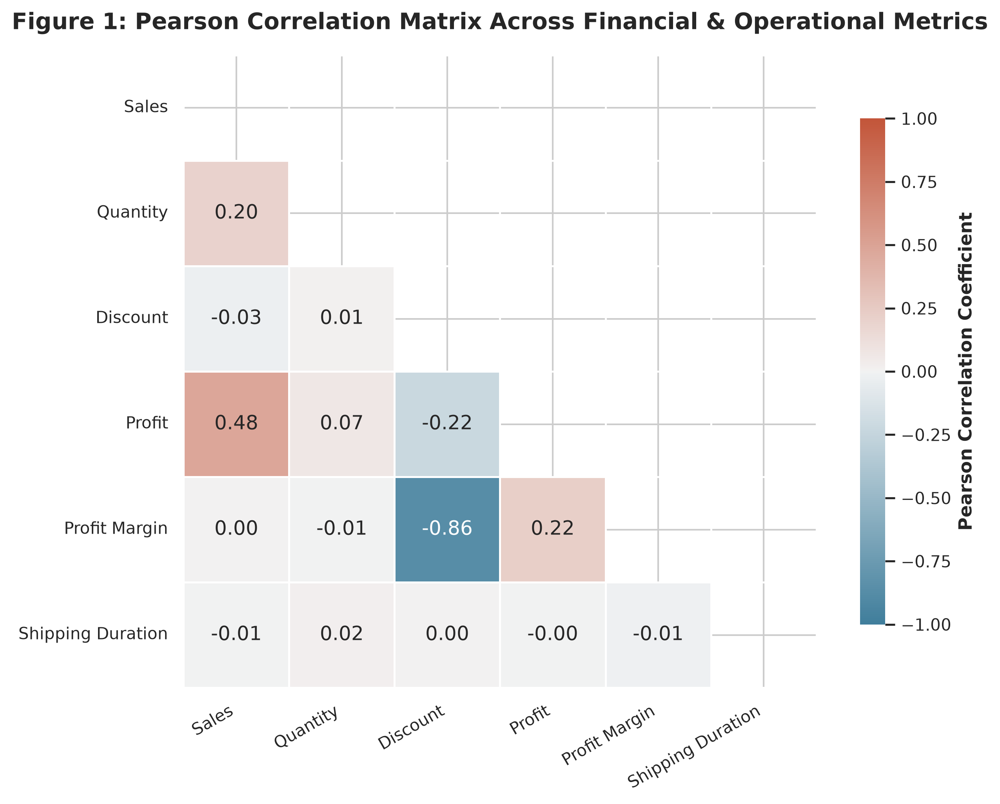
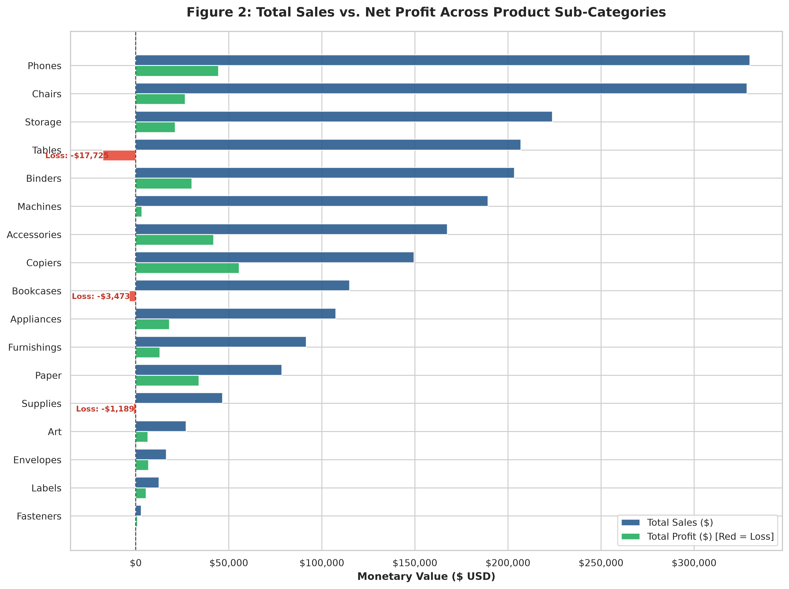
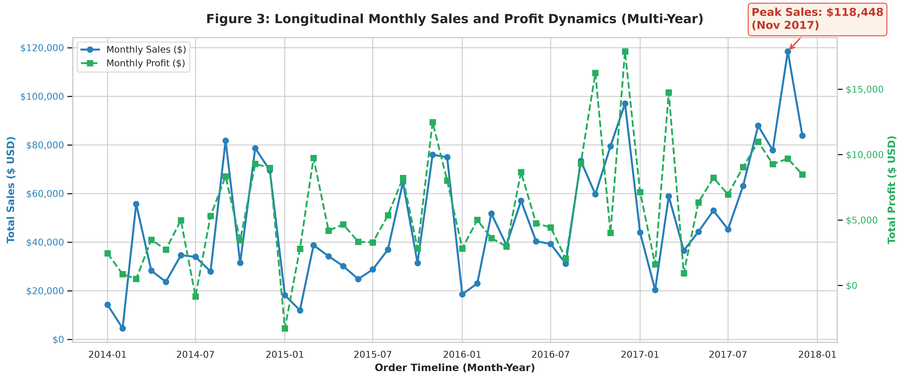
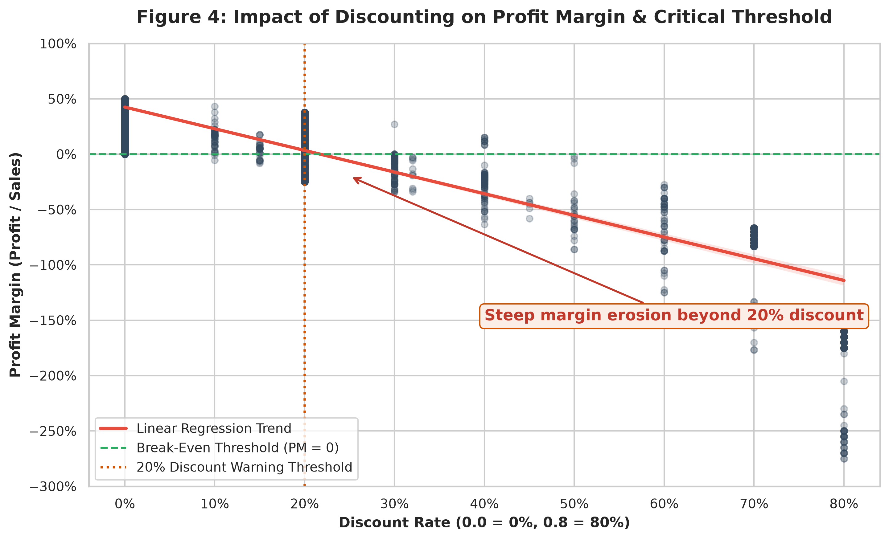
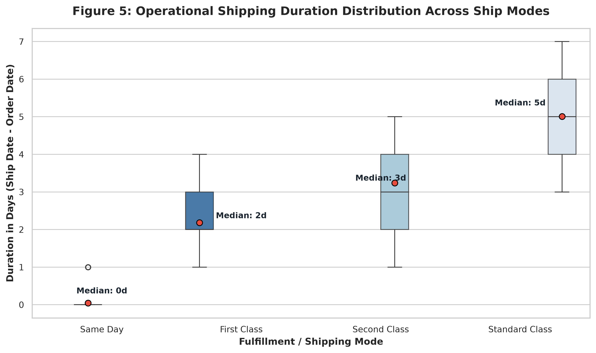
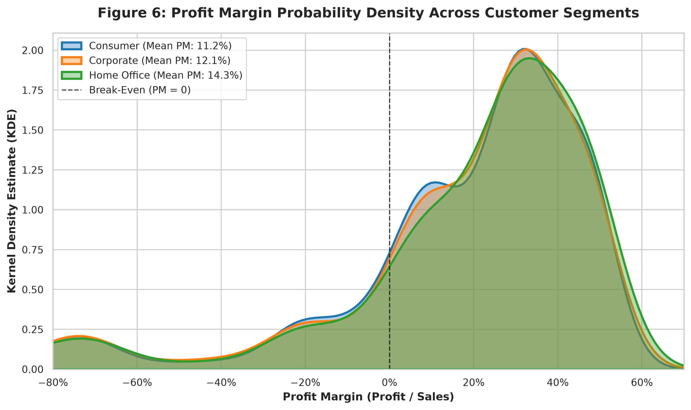
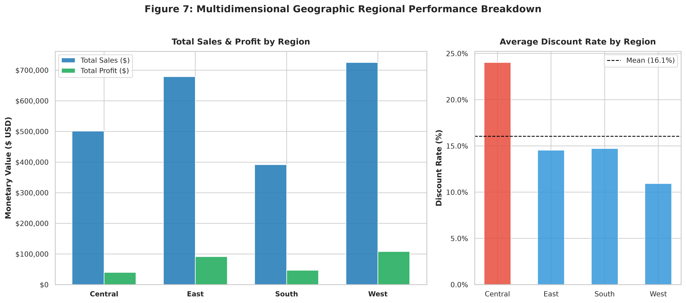
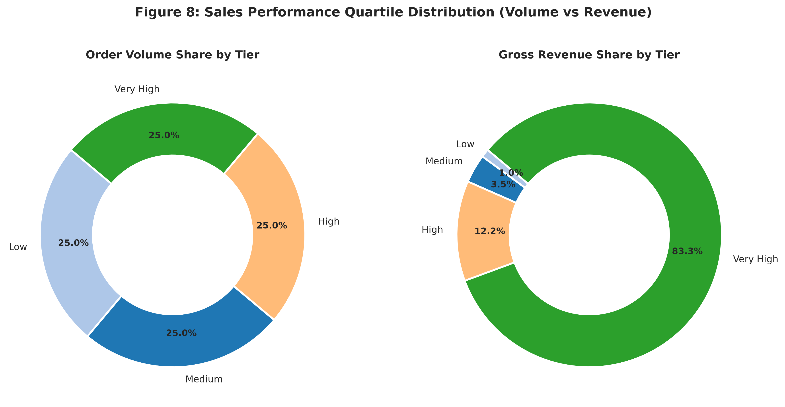

# Executive Analytics & Automated KPI Report
**Target Enterprise:** Multinational Retail Enterprise (Superstore Analytics)  
**Report Generated At:** 2026-09-07 03:05:36  
**Pipeline Status:** Production Ready | Automated Ingestion & ETL Completed  

---

## 1. Executive Summary & Core Financial KPIs

| Key Performance Indicator (KPI) | Value | Benchmark / Interpretation |
| :--- | :--- | :--- |
| **Total Gross Revenue** | **$2,297,200.75** | Cumulative top-line sales volume |
| **Total Net Profit** | **$286,397.03** | Net bottom-line enterprise earnings |
| **Enterprise Profit Margin** | **12.47%** | Overall margin efficiency |
| **Total Line Items Processed** | **9,994** | Validated transaction items |
| **Total Unique Orders** | **5,009** | Distinct purchase baskets |
| **Total Unique Customers** | **793** | Active enterprise accounts |
| **Average Order Value (AOV)** | **$458.61** | Revenue generated per unique order |
| **Average Shipping Turnaround** | **3.96 Days** | Mean delivery SLA cycle |
| **Loss-Making Transactions** | **1,871 (18.72%)** | Orders with negative profit contribution |
| **Total Negative Profit Drag** | **$156,131.28** | Total capital lost on unprofitable orders |

---

## 2. Product Sub-Category Profitability Rankings

### 2.1 Top 3 Value-Generating Sub-Categories
| Rank   | Sub-Category   | Total Sales ($)   | Net Profit ($)   | Profit Margin (%)   |
|--------|----------------|-------------------|------------------|---------------------|
| #1     | Copiers        | $149,528.03       | $55,617.82       | 37.20%              |
| #2     | Phones         | $330,007.06       | $44,515.73       | 13.49%              |
| #3     | Accessories    | $167,380.31       | $41,936.64       | 25.05%              |

### 2.2 Top 3 Loss-Making / Value-Destroying Sub-Categories
| Rank   | Sub-Category   | Total Sales ($)   | Net Profit ($)   | Profit Margin (%)   |
|--------|----------------|-------------------|------------------|---------------------|
| #1     | Tables         | $206,965.53       | $-17,725.48      | -8.56%              |
| #2     | Bookcases      | $114,879.99       | $-3,472.56       | -3.02%              |
| #3     | Supplies       | $46,673.54        | $-1,189.10       | -2.55%              |

---

## 3. Key Findings & Diagnostic Visualizations

### 3.1 Correlation & Multidimensional Interactions

- **Discount vs. Profit Margin Inversion**: Discount exhibits a severe negative correlation with Profit and Profit Margin, indicating uncontrolled discounting directly erodes profitability.
- **Volume vs. Profitability**: High transaction quantity without price discipline yields margin degradation.

### 3.2 Sub-Category Performance Disparity

- **High-Margin Champions**: `Copiers`, `Phones`, and `Accessories` yield substantial profit margins.
- **Structural Value Drains**: `Tables`, `Bookcases`, and `Supplies` generate net operational losses despite significant sales volumes.

### 3.3 Longitudinal Seasonality & Revenue Trajectory

- **Q4 Surge**: Consistent spikes in sales and profit during November and December reflect strong holiday retail seasonality.
- **Q1 Dips**: January and February show recurring post-holiday contractions, indicating opportunities for promotional smoothing.

### 3.4 Discounting Tipping Point

- **Critical Discount Threshold**: Transactions with discounts ≤ 20% remain reliably profitable. When discounts exceed **20%**, margin drops steeply into negative territory, and discounts ≥ 50% cause catastrophic margin destruction (PM < -100%).

### 3.5 Logistics & Operational Delivery SLA

- **Standard Class** averages ~5 days delivery turnaround.
- **First Class** and **Same Day** modes maintain consistent expedited SLAs (1–2 days).

### 3.6 Segment & Regional Distribution

- **Regional Margin Imbalance**: The `Central` region suffers from depressed margins due to higher average discount rates compared to `West` and `East`.
- **Pareto Revenue Concentration**: The `Very High` sales tier drives the majority of total enterprise revenue.

---

## 4. Strategic Business Recommendations

1. **Implement Automated Discount Guardrails**:
   - Cap discretionary sales discounts at **20%** across standard product lines.
   - Mandate executive override approval for any B2B contract requiring discounts > 30%.

2. **Catalog Rationalization & Price Restructuring**:
   - Re-negotiate vendor pricing or revise packaging dimensions for `Tables` and `Bookcases` to eliminate structural negative margins.
   - Bundle loss-making sub-categories exclusively with high-margin champions (`Accessories`, `Copiers`).

3. **Regional Intervention in Central Region**:
   - Conduct a comprehensive pricing audit in the Central region to align discount policies with high-performing Western and Eastern sales protocols.

4. **Supply Chain SLA Optimization**:
   - Incentivize customers to utilize consolidated `Standard Class` shipping for non-urgent high-volume orders to lower operational fulfillment costs.

---
*Report automatically generated by Superstore Analytics Automated Pipeline.*
